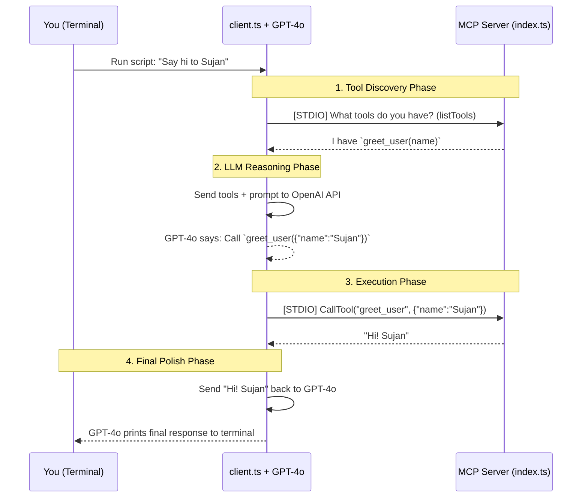

# Project Architecture

Here is the visual representation of exactly what happens when you run the custom LLM client (`client.ts`).

```mermaid
sequenceDiagram
    participant User as You (Terminal)
    participant Client as client.ts + GPT-4o
    participant Server as MCP Server (index.ts)

    User->>Client: Run script: "Say hi to Sujan"
    
    note over Client,Server: 1. Tool Discovery Phase
    Client->>Server: [STDIO] What tools do you have? (listTools)
    Server-->>Client: I have `greet_user(name)`
    
    note over Client: 2. LLM Reasoning Phase
    Client->>Client: Send tools + prompt to OpenAI API
    Client-->>Client: GPT-4o says: Call `greet_user({"name":"Sujan"})`
    
    note over Client,Server: 3. Execution Phase
    Client->>Server: [STDIO] CallTool("greet_user", {"name":"Sujan"})
    Server-->>Client: "Hi! Sujan"
    
    note over User,Client: 4. Final Polish Phase
    Client->>Client: Send "Hi! Sujan" back to GPT-4o
    Client-->>User: GPT-4o prints final response to terminal
```
